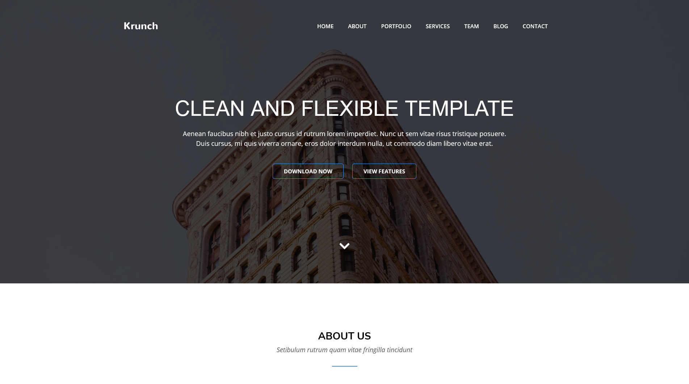

# Bookstore

  Krunch website clone. Non responsive and only for destkop screens

  

## Built With

- HTML,
- CSS,

## Live Demo

[Heroku](https://rawcdn.githack.com/FuadNabi/Krunch-clone/59243e7a4d4dc64c651914aa2db3dddc0e61a9da/index.html)

## Setup

  If you want to try this application locally, follow the steps below:

  1. Clone the project using `git clone https://github.com/FuadNabi/Krunch-clone` command.

  2. run `cd Bookstore`.

  3. run `npm install`.

  4. run `npm start`.

## Author

👤 **Fuad Nabiyev**

## 🤝 Contributing

Contributions, issues, and feature requests are welcome!

Feel free to check the <a href="https://github.com/FuadNabi/Krunch-clone/issues" target="_blank">issues page</a>.

## Show your support

Give a ⭐️ if you like this project!
